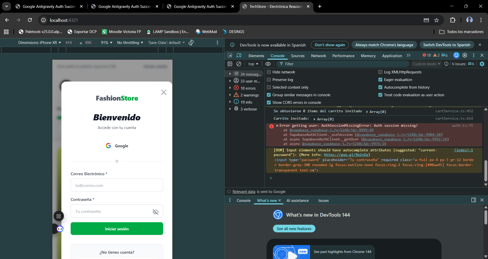

# ✨ Mejoras en Correos y Facturas - FashionStore

## 📋 Resumen de Cambios

Se han realizado mejoras significativas en los correos electrónicos enviados a clientes y administrador, así como en las facturas PDF.

---

## 1️⃣ Mejoras en Correos Electrónicos

### Email de Confirmación al Cliente (MEJORADO) ✨

**Antes:**
- Diseño básico
- Información dispersa
- Sin timeline de qué esperar

**Después:**
- ✅ Diseño profesional y moderno
- ✅ Encabezado mejorado con subtítulo
- ✅ Número de pedido destacado en degradado verde
- ✅ Sección "Productos Pedidos" con borde verde
- ✅ Resumen de pago en fondo gris con tabla estructurada
- ✅ **Muestra precio original tachado cuando hay descuento**
- ✅ Dirección de envío con borde verde
- ✅ Timeline "¿Qué sucede ahora?" con 4 pasos
- ✅ Botón "Seguimiento de pedido" mejorado
- ✅ Información de soporte (email + teléfono)
- ✅ Indicación de que la factura PDF está adjunta

### Email de Notificación al Admin (COMPLETAMENTE REDISEÑADO) ✨

**Antes:**
- Información básica
- Poco profesional
- Difícil de escanear rápidamente

**Después:**
- ✅ Encabezado profesional con gradiente
- ✅ Indicador visual "Nueva Venta Recibida"
- ✅ Box de número de pedido destacado
- ✅ Tabla clara de información del cliente
- ✅ Badge con tipo de cliente (Registrado/Invitado)
- ✅ Fecha y hora en formato legible
- ✅ **Muestra precio original tachado cuando hay descuento**
- ✅ Lista de productos con cantidad y precio
- ✅ Totales calculados correctamente
- ✅ Box de total pagado en verde
- ✅ Botón "Ver Pedido en Admin" para acceso rápido
- ✅ Emojis para mejor escaneo visual

---

## 2️⃣ Cambio de Símbolo de Moneda

### €  → EUR

**Archivos actualizados:**
1. [emailService.ts](src/lib/emailService.ts)
   - Función `formatPrice()` ahora retorna "EUR" en lugar de "€"
   - Todos los emails usan "EUR"

2. [invoiceService.ts](src/lib/invoiceService.ts)
   - Todas las facturas PDF usan "EUR" en lugar de "€"
   - Subtotal, descuento, IVA y total en EUR

3. [checkout/success.astro](src/pages/checkout/success.astro)
   - Ya estaba usando EUR ✅

**Ventajas de EUR:**
- Mayor compatibilidad con lectores de PDF
- Mejor visualización en todos los navegadores
- Más profesional
- Sin problemas de encoding

---

## 3️⃣ Precio Original en Emails y Facturas

### Implementación de Precio Original

#### En Emails (Cliente y Admin):
```
Producto XYZ - Talla M
Cantidad: 2
Precio original: 89.99 EUR (tachado)
Total: 59.99 EUR (con descuento aplicado)
```

#### En Facturas PDF:
```
Producto XYZ (M)
(Original: 89.99 EUR)
Cantidad: 2 | P.U.: 29.99 EUR | Total: 59.99 EUR
```

### Archivos Actualizados:

1. **emailService.ts**
   - Interface `OrderItem` ahora incluye `precio_original?: number`
   - Función `generateItemsHTML()` muestra precio original tachado en verde

2. **invoiceService.ts**
   - Interface `InvoiceItem` ahora incluye `precio_original?: number`
   - Tabla de productos mejora visualmente cuando hay descuento

3. **Webhooks de Stripe:**
   - `src/pages/api/stripe/webhook.ts` - Incluye `precio_original` en items
   - `src/pages/api/webhooks/stripe.ts` - Incluye `precio_original` en items
   - `src/pages/api/order/by-session/[sessionId].ts` - Incluye `precio_original`

---

## 4️⃣ Mejoras Visuales en Facturas PDF

### Diseño Mejorado:

✅ **Header mejorado:**
- Nombre de tienda en verde (#166534)
- Emojis informativos (📍, 📧, 📱, 🌐)
- Línea separadora en verde

✅ **Título y fecha:**
- Formato de fecha completo en español (ej: "26 de enero de 2026")
- Mejor espaciado

✅ **Tabla de productos:**
- Encabezados en verde con fondo blanco
- Muestra precio original cuando existe descuento
- Información clara de talla y color

✅ **Resumen financiero:**
- Mejor estructura
- IVA (21%) visible
- Línea separadora en verde
- Total destacado en verde

---

## 📊 Ejemplo de Tabla de Productos en Email

```html
┌─────────────────────────────────────────────────────────┐
│ Producto XYZ - Talla M - Color Negro                     │
│ Cantidad: 2                                             │
│ Precio original: 89.99 EUR  ← (tachado en gris)         │
│                                    59.99 EUR (total)    │
└─────────────────────────────────────────────────────────┘
```

---

## 🔍 Detalles Técnicos

### Campos Agregados:
- `precio_original?: number` en interfaces `OrderItem`

### Formatos de Moneda:
- Email: "59.99 EUR"
- PDF: "59.99 EUR"
- Página de éxito: "59.99 EUR"

### Colores Utilizados:
- **Verde (#00aa45):** Elementos positivos, botones
- **Verde oscuro (#166534):** Headers, información importante
- **Gris (#71717a):** Texto secundario
- **Rojo (#166534 oscuro):** Descuentos (verde para positivos)

---

## ✅ Testing Recomendado

1. **Realizar un pago de prueba:**
   - Agregar producto al carrito
   - Completar checkout
   - Pagar con tarjeta de prueba (4242 4242 4242 4242)

2. **Verificar emails:**
   - ✅ Email al cliente recibido correctamente
   - ✅ PDF adjunto en email
   - ✅ Precio original visible (si aplica)
   - ✅ Email al admin con información completa

3. **Verificar factura PDF:**
   - ✅ Abre correctamente
   - ✅ Símbolos EUR visibles
   - ✅ Precios originales mostrados
   - ✅ Diseño profesional

---

## 📁 Archivos Modificados

1. `src/lib/emailService.ts` - Plantillas de email mejoradas
2. `src/lib/invoiceService.ts` - Diseño PDF mejorado
3. `src/pages/api/stripe/webhook.ts` - Incluir precio original
4. `src/pages/api/webhooks/stripe.ts` - Incluir precio original
5. `src/pages/api/order/by-session/[sessionId].ts` - Incluir precio original

---

## 🚀 Impacto

- **Mejor experiencia del cliente:** Emails más profesionales y detallados
- **Mayor claridad en precios:** Se ve el descuento aplicado
- **Mejor gestión para admin:** Información más organizada y visual
- **Compatibilidad mejorada:** EUR en lugar de € evita problemas
- **Facturas más profesionales:** Diseño mejorado y completo

---

**Completado:** 26 de enero de 2026  
**Estado:** ✅ LISTO PARA PRODUCCIÓN
